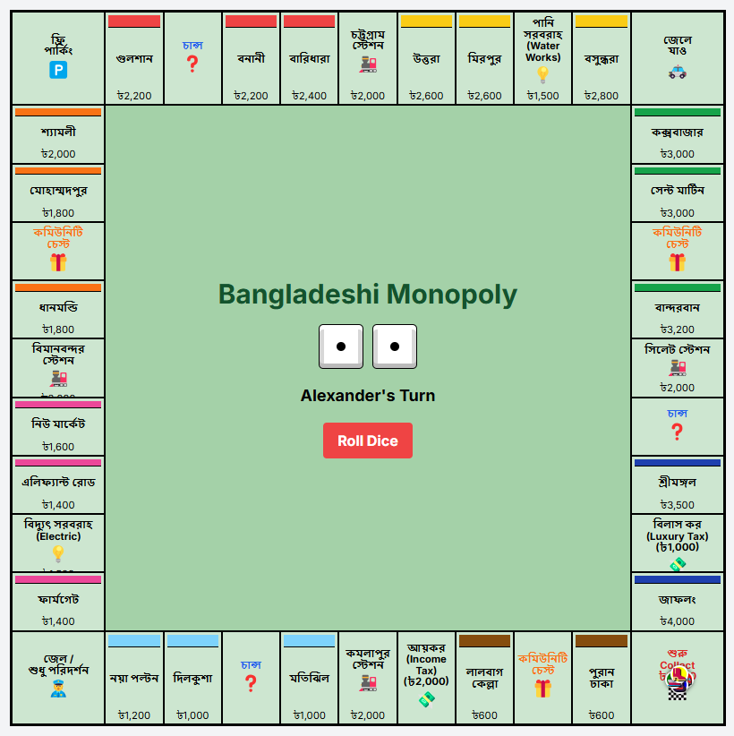

# Bangladeshi Monopoly - Multiplayer Edition

A modern, browser-based multiplayer Monopoly game with a Bangladeshi theme. Play online or on your local network with real-time WebSocket communication.



## 🌟 Features

### Core Gameplay
- 🎲 **Classic Monopoly Mechanics** — Roll dice, buy properties, pay rent, draw cards
- 🇧🇩 **Bangladeshi Theme** — Streets like পুরান ঢাকা, গুলশান, কক্সবাজার
- 🏠 **Property Development** — Build houses and hotels to increase rent
- 💰 **Property Mortgage System** — Mortgage properties for cash
- 🔄 **Player Trading** — Trade properties and money with other players
- 🎯 **Auction System** — Automatic auctions when players decline purchases
- 💳 **Complete Bankruptcy Logic** — Asset liquidation and game elimination

### Multiplayer Features
- 🌐 **Online & LAN Play** — Play with friends anywhere
- 🚪 **Room System** — Create private or public game rooms
- 👥 **2-8 Players** — Support for up to 8 players per game
- 🔄 **Real-time Sync** — Instant game state updates via WebSocket
- 💬 **Chat System** — In-game chat with all players
- 🔌 **Reconnection Logic** — Rejoin games if disconnected
- 📊 **Game History** — Track all moves and transactions

### UI/UX
- 📱 **Responsive Design** — Works on desktop, tablet, and mobile
- 🎨 **Modern Interface** — Clean, intuitive design with Tailwind CSS
- 🔔 **Toast Notifications** — Real-time feedback for all actions
- 🎭 **Player Tokens** — Unique emojis for each player
- 🎨 **Color Coding** — Each player has a distinct color

## 🚀 Quick Start

### Prerequisites
- Node.js 18+ installed
- Modern web browser (Chrome, Firefox, Safari, Edge)

### Installation

1. **Clone the repository**
   ```bash
   git clone https://github.com/WakifRajin/monopoly-web.git
   cd monopoly-web
   ```

2. **Install dependencies**
   ```bash
   cd server
   npm install
   ```

3. **Start the server**
   ```bash
   npm start
   ```
   
   For development with auto-restart:
   ```bash
   npm run dev
   ```

4. **Open in browser**
   - Navigate to `http://localhost:3000`
   - Or use your computer's IP address for LAN play: `http://YOUR_IP:3000`

## 📖 How to Play

### Starting a Game

1. **Create or Join a Room**
   - Click "Create Room" to start a new game
   - Or click "Join Room" and enter a 6-digit room code
   - Or select a public room from the list

2. **Wait for Players**
   - Share your room code with friends
   - Players can join until the room is full

3. **Ready Up**
   - All players must click "Ready" before starting
   - The host can start the game once everyone is ready

### During the Game

1. **Roll Dice** - Click "Roll Dice" on your turn
2. **Buy Properties** - Land on unowned properties to purchase
3. **Build Houses & Hotels** - Own all properties in a color group to build
4. **Trade with Players** - Exchange properties and money
5. **Manage Money** - Mortgage properties when short on cash

## 🏗️ Architecture

The game is built with a client-server architecture:

- **Backend**: Node.js + Express + Socket.IO
- **Frontend**: Vanilla JavaScript + Tailwind CSS
- **Communication**: WebSocket for real-time updates

## 📝 Development Status

### ✅ Phase 1: Core Multiplayer (Complete)
- Backend server with Express and Socket.IO
- Room creation and management
- Player joining and ready system
- WebSocket communication
- Lobby UI with public rooms list

### 🚧 Phase 2: Game Implementation (In Progress)
- Complete game board UI
- Property purchase and rent
- Building system (houses/hotels)
- Trading system
- Auction system

### 📋 Phase 3: Enhanced Features (Planned)
- Chat system
- Game persistence
- Statistics and achievements
- Mobile optimization
- AI players

## 📄 License

This project is licensed under the MIT License - see [LICENSE](LICENSE) file for details.

---

Made with ❤️ for Monopoly fans in Bangladesh 🇧🇩
